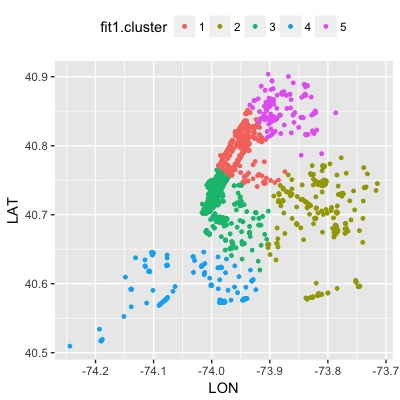
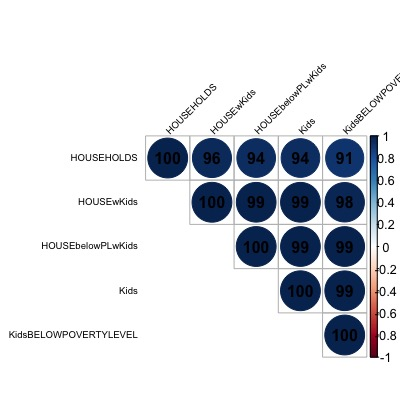
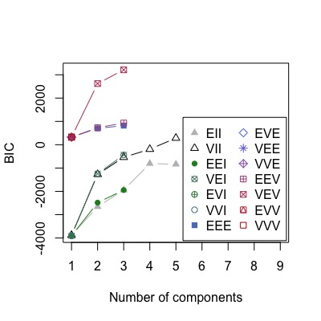
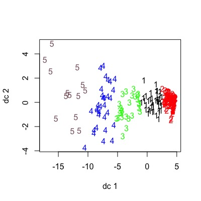
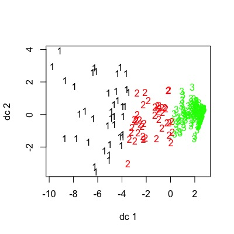
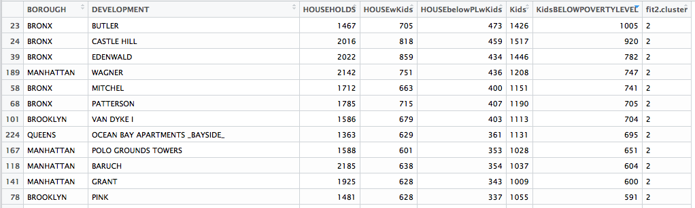
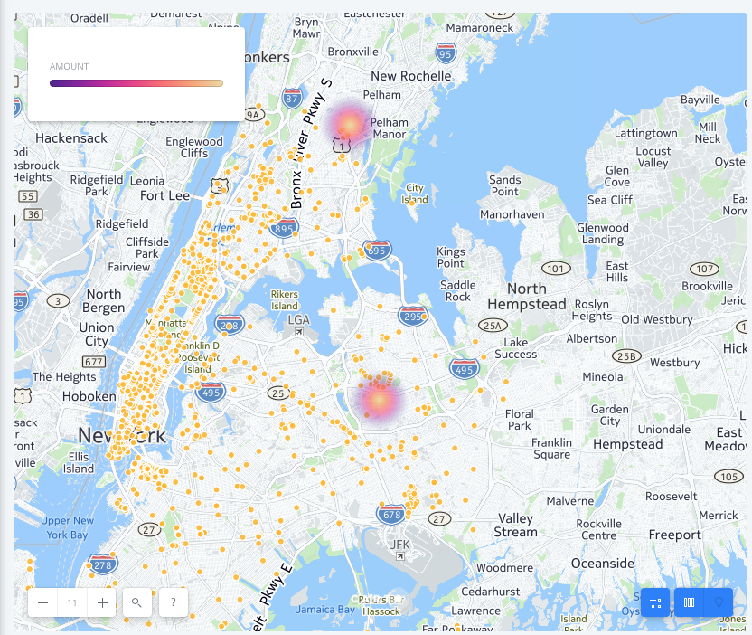

```{r}
library(tidyr, dplyr)
library(ggplot2)
library(broom)
library(RColorBrewer)
library(cluster)
library(useful)
library(pvclust)
library(mclust)
library(fpc)
library(corrplot)
library(ggmap) 

#construct freeWIFI dataframe
Wifi<- read.table("FreeWiFi.csv", sep = ",", header = TRUE)
W1 <- dplyr::select(Wifi, LON, LAT)

W1 <- na.omit(W1)
W1 <- scale(W1)
fit1 <- kmeans(W1, 10) 
fit1$cluster
Wifi <- data.frame(Wifi, fit1$cluster)
#names(W2) <- c("latitude", "longitude","cluster") 
Wifi$fit1.cluster <- as.factor(Wifi$fit1.cluster)

ggplot(Wifi, aes(LON, LAT, colour = fit1.cluster)) + geom_line() + xlab("longitude") + ylab("latitude")
p <- ggplot(Wifi,aes(LON, LAT))
p + geom_point(size=1,aes(colour=fit1.cluster))+theme(legend.position='top')
```

image: 

```{r}
#construct dataframe that kids in lower income home
K1<- read.table("SeniorsSchoolAgedPoverty.csv", sep = ",", header = TRUE)
K1 <- na.omit(K1)
K2 <- dplyr::select(K1, HOUSEHOLDS,HOUSEwKids,HOUSEbelowPLwKids,Kids,KidsBELOWPOVERTYLEVEL)
K2 <- na.omit(K2)
K2 <- scale(K2)
mydata <- K2


COR <- cor(K2)
corrplot(COR, order="AOE", method="circle", tl.pos="lt", type="upper",        
         tl.col="black", tl.cex=0.6, tl.srt=45, 
         addCoef.col="black", addCoefasPercent = TRUE,
         sig.level=0.50, insig = "blank")
```

image: 
```{r}
#determining how many clusters we need for this data set
fit <- Mclust(mydata)
plot(fit)
summary(fit)
```

----------------------------------------------------
Gaussian finite mixture model fitted by EM algorithm 
----------------------------------------------------

Mclust VEV (ellipsoidal, equal shape) model with 5 components:

 log.likelihood   n df     BIC      ICL
       1340.144 229 88 2202.12 2163.019

Clustering table:
 1  2  3  4  5 
55 32 64 66 12 

image: 

```{r}
# K-Means Clustering with 5 clusters
fit1 <- kmeans(mydata, 5)

# Cluster Plot against 1st 2 principal components

# vary parameters for most readable graph

clusplot(mydata, fit1$cluster, color=TRUE, shade=TRUE, 
         labels=2, lines=0)

# Centroid Plot against 1st 2 discriminant functions

plotcluster(mydata, fit1$cluster)

fit2 <- kmeans(mydata, 3)

# Cluster Plot against 1st 2 principal components

# vary parameters for most readable graph

clusplot(mydata, fit2$cluster, color=TRUE, shade=TRUE, 
         labels=2, lines=0)

# Centroid Plot against 1st 2 discriminant functions

plotcluster(mydata, fit2$cluster)
```
image: 

image: 


```{r}
fit2 <- kmeans(K2, 5) 
fit2$cluster
K1 <- data.frame(K1, fit2$cluster)
K1$fit2.cluster <- as.factor(K1$fit2.cluster)
```

image: 

```{r}
K3 = dplyr::filter(K1, fit2.cluster == 2)
locations <- geocode(as.character(K3$DEVELOPMENT))

write.csv(locations, file = "locations.csv", row.names = FALSE)
```

image: 
```{r}
location<- read.table("locations.csv", sep = ",", header = TRUE)
L1 <- na.omit(location)

ggplot(L1, aes(lon, lat)) + geom_line() + xlab("longitude") + ylab("latitude")
p <- ggplot(L1,aes(lon, lat))
p + geom_point(size=1)+theme(legend.position='top')
```

```{r}
Wifi2<- read.table("wifi2017Jan.csv", sep = ",", header = TRUE)
library <- dplyr::filter(Wifi2, Location_T == "Library")
NYPL <- dplyr::filter(library, Provider == "NYPL")
MNYPL <- dplyr::filter(NYPL, City == "New York")
subway  <- dplyr::filter(Wifi2, Location_T == "Subway Station")
Kiosk  <- dplyr::filter(Wifi2, Location_T == "Outdoor Kiosk")

NYtrumptower<- read.table("NYtrumptower.csv", sep = ",", header = TRUE)
NYCMayorlocation <- geocode(as.character(NYCMayor$Address))
Trumplocations <- geocode(as.character(NYtrumptower$address))

write.csv(Trumplocations, file = "trumplocations.csv", row.names = FALSE)
write.csv(NYCMayorlocation, file = "NYCMayorlocation.csv", row.names = FALSE)
```

